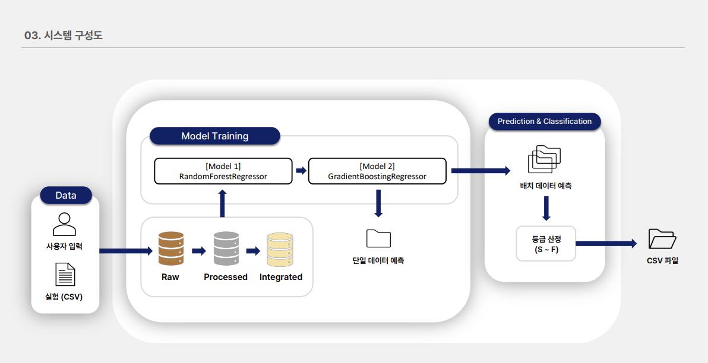
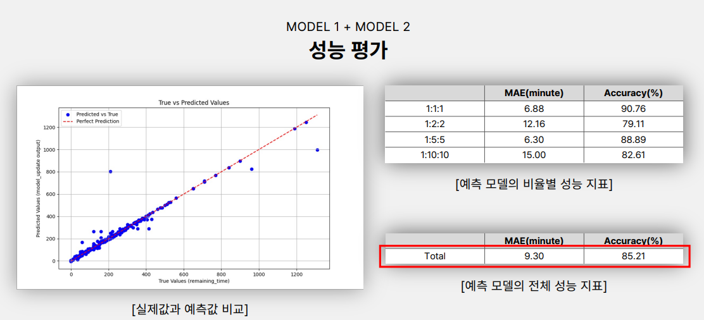
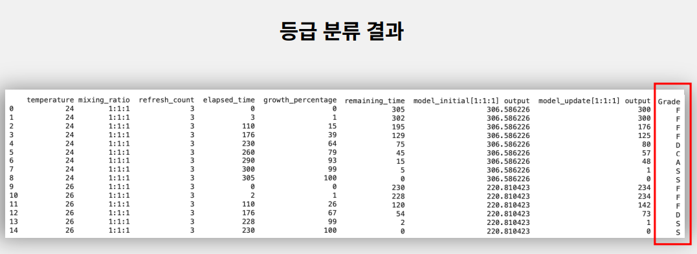

# Fermentation Time Prediction Based on Environmental Data

This project presents a machine learning-based algorithm that predicts the fermentation time of sourdough starters using environmental variables. Conducted as part of a university-industry collaborative capstone project with Toasters Inc., the system aims to enhance the accuracy and convenience of home baking by automating fermentation control.

---

## Project Overview

- **Project Title**: Fermentation Time Prediction Algorithm Using Environmental Information
- **Collaboration**: Toasters Inc. (Industry Partner), HUFS (Academic Institution)
- **Duration**: September 2024 – December 2024
- **Team**: 5 undergraduate students, 2 faculty mentors, 1 industry mentor

---

## Objective

The objective of this project is to develop a real-time prediction system that:
- Estimates total fermentation time based on early-stage environmental data
- Updates remaining fermentation time based on real-time growth status
- Provides grading of fermentation status using quantitative metrics
- Enables potential integration with IoT fermentation equipment for automation

---

## System Description

### Dual-Model Architecture

1. **Initial Prediction Model (model_initial)**
   - Input: Temperature, Refresh Count
   - Algorithm: RandomForestRegressor
   - Purpose: Estimate total fermentation time from 0% state

2. **Real-Time Update Model (model_update)**
   - Input: Elapsed Time, Growth Percentage
   - Algorithm: GradientBoostingRegressor
   - Purpose: Refine remaining time prediction during fermentation

Each model is separately trained based on the sourdough ratio (e.g., 1:1:1, 1:2:2, 1:5:5).

### Grading System

A 6-level grading system (S, A, B, C, D, F) was designed based on the proportion of remaining to total predicted time. This allows users to understand the fermentation progress at a glance.

### Correction Logic

Due to the limited size of the initial dataset, logical correction rules were introduced. For example, if the predicted remaining time is zero while growth percentage is below 100%, the system adjusts the remaining time to 1 minute to avoid misguidance.

---

## Accuracy and Evaluation

The model was evaluated using collected experimental data. The average time difference between predicted and actual completion was approximately **12 minutes**. When evaluated based on a tolerance of ±10 minutes, the accuracy reached **85.21%**. While this result leaves some room for improvement, it is expected that the accuracy will increase significantly as more data is accumulated in the future.

---

## Technical Stack

| Component         | Technology                      |
|------------------|----------------------------------|
| Language          | Python                          |
| Machine Learning  | scikit-learn                    |
| Algorithms        | Random Forest, Gradient Boosting|
| Visualization     | matplotlib, seaborn             |
| Development Tools | Jupyter Notebook                |

---

## Roles and Contributions

| Name            | Responsibilities                                                   |
|-----------------|---------------------------------------------------------------------|
| Daehan Kim      | Model design, implementation, evaluation                            |
| Dohyun Kim      | Algorithm design, grading logic                                     |
| Hyeri Kim       | Project management, documentation, presentation                     |
| Yubin Jung      | Literature review, model development support                        |
| Junyoung Ham    | Data preprocessing, statistical analysis, data update management    |

---

## Outcome and Future Work

- Functional dual-model prediction system for fermentation
- Real-time progress grading and fermentation management interface
- Usable prototype ready for integration with IoT fermentation hardware
- Future improvements will focus on:
  - Expanding the dataset for better generalization
  - Refining correction logic based on usage feedback
  - Implementing a web/mobile user interface for broader accessibility

---

## Visual Assets

### System Architecture  
Illustrates the overall data flow from user input, processing, and model prediction to grading logic.  

### Prediction Performance  
Shows the model's performance for each fermentation ratio using MAE and accuracy metrics.  

### Grading Scheme  
Visual representation of the 6-level grading system based on remaining fermentation time.  

